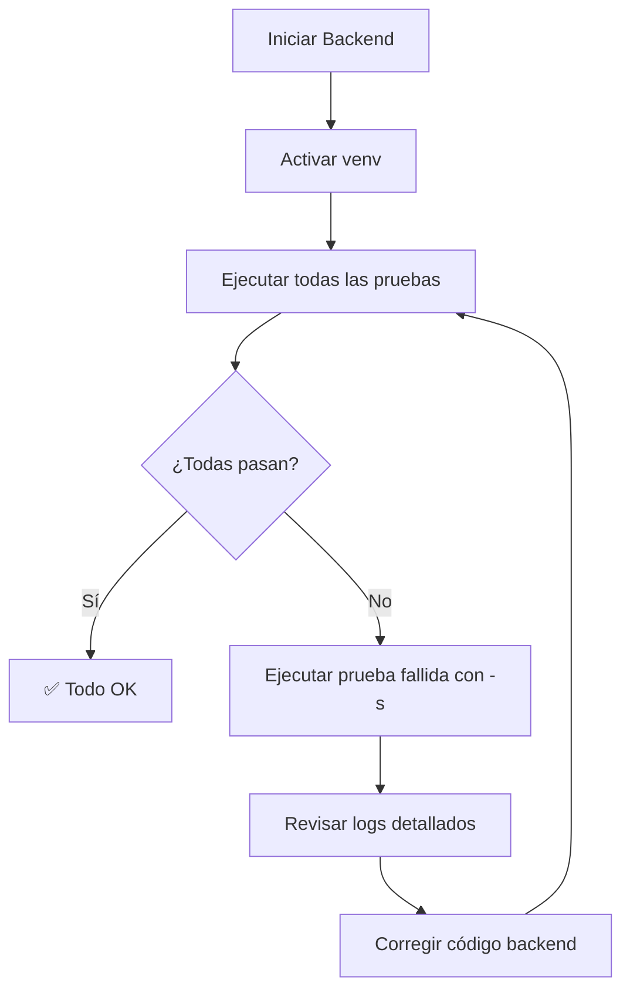

# 🚀 GUÍA DE EJECUCIÓN - Pruebas de Signos Vitales

## ⚡ Inicio Rápido

### 1. Preparar el Entorno

```bash
# Navegar al directorio de pruebas
cd /home/yorman/Documentos/Github/Grupo04-Proyecto/Pruebas/PruebasUnitarias

# Activar entorno virtual
source venv/bin/activate

# Verificar instalación
pytest --version  # Debe mostrar: pytest 8.4.2
```

### 2. Iniciar el Backend

**Terminal 1:**
```bash
cd /home/yorman/Documentos/Github/Grupo04-Proyecto/Backend
uvicorn app.main:app --reload
```

Esperar a ver:
```
INFO:     Uvicorn running on http://127.0.0.1:8000
INFO:     Application startup complete.
```

### 3. Ejecutar las Pruebas

**Terminal 2:**
```bash
cd /home/yorman/Documentos/Github/Grupo04-Proyecto/Pruebas/PruebasUnitarias
pytest RegistroSignosVitales/test_signos_vitales_http.py -v -s
```

---

## 📋 Opciones de Ejecución

### Ejecutar TODAS las pruebas

```bash
pytest RegistroSignosVitales/test_signos_vitales_http.py -v
```

**Salida esperada:**
```
RegistroSignosVitales/test_signos_vitales_http.py::TestCaso1...::test... PASSED [ 20%]
RegistroSignosVitales/test_signos_vitales_http.py::TestCaso2...::test... PASSED [ 40%]
RegistroSignosVitales/test_signos_vitales_http.py::TestCaso3...::test... PASSED [ 60%]
RegistroSignosVitales/test_signos_vitales_http.py::TestCaso4...::test... PASSED [ 80%]
RegistroSignosVitales/test_signos_vitales_http.py::TestCaso5...::test... PASSED [100%]

============= 5 passed in 3.45s =============
```

---

### Ejecutar caso por caso

#### CASO 1: Signos Vitales Válidos ✅

```bash
pytest RegistroSignosVitales/test_signos_vitales_http.py::TestCaso1RegistroSignosVitalesValidos::test_registro_signos_vitales_validos_http -v -s
```

**Lo que hace:** Registra signos vitales normales (PA: 120/80, FC: 80, Temp: 36.5°C)

---

#### CASO 2: Frecuencia Cardíaca Negativa ❌

```bash
pytest RegistroSignosVitales/test_signos_vitales_http.py::TestCaso2RechazoFrecuenciaCardiaNegativa::test_rechazo_frecuencia_cardiaca_negativa_http -v -s
```

**Lo que hace:** Intenta registrar FC: -10 (valor inválido)

---

#### CASO 3: Valores Extremos (Alerta Médica) ⚠️

```bash
pytest RegistroSignosVitales/test_signos_vitales_http.py::TestCaso3RegistroValoresExtremosAlerta::test_registro_valores_extremos_http -v -s
```

**Lo que hace:** Registra temperatura 41.7°C (fiebre muy alta)

---

#### CASO 4: Formato Inválido de Presión Arterial ❌

```bash
pytest RegistroSignosVitales/test_signos_vitales_http.py::TestCaso4RechazoFormatoInvalidoPresionArterial::test_rechazo_formato_presion_arterial_http -v -s
```

**Lo que hace:** Intenta registrar PA: "120-80" (formato incorrecto)

---

#### CASO 5: Paciente Inexistente ❌

```bash
pytest RegistroSignosVitales/test_signos_vitales_http.py::TestCaso5RechazoPacienteInexistente::test_rechazo_paciente_inexistente_http -v -s
```

**Lo que hace:** Intenta registrar signos vitales para paciente_id: 99999

---

## 🔍 Opciones Avanzadas

### Ver salida detallada con prints

```bash
pytest RegistroSignosVitales/ -v -s
```

La opción `-s` muestra todos los `print()` con:
- 🔐 Autenticación del médico
- 📋 Creación de paciente de prueba
- 📤 Request enviado al servidor
- 📥 Response recibido
- ✅ Validaciones realizadas

---

### Generar reporte HTML

```bash
pytest RegistroSignosVitales/ -v --html=report_signos_vitales.html --self-contained-html
```

Instalar plugin si es necesario:
```bash
pip install pytest-html
```

---

### Ejecutar con coverage (cobertura)

```bash
pytest RegistroSignosVitales/ -v --cov=app.routes.consulta_routes --cov-report=html
```

Instalar plugin si es necesario:
```bash
pip install pytest-cov
```

---

### Ejecutar solo tests que fallaron

```bash
pytest RegistroSignosVitales/ --lf -v
```

---

### Ejecutar y detener en el primer fallo

```bash
pytest RegistroSignosVitales/ -x -v
```

---

## 📊 Interpretación de Resultados

### ✅ Prueba PASSED (Exitosa)

```
RegistroSignosVitales/test_signos_vitales_http.py::TestCaso1...::test... PASSED [20%]

================================================================================
✅ CASO 1 PASADO: Signos vitales válidos registrados correctamente
================================================================================
```

**Significado:** El caso de prueba funcionó como se esperaba.

---

### ❌ Prueba FAILED (Fallida)

```
RegistroSignosVitales/test_signos_vitales_http.py::TestCaso2...::test... FAILED [40%]

FAILED ... AssertionError: Se esperaba 400 o 422, pero se recibió 200
```

**Significado:** La prueba falló. El servidor no está validando correctamente.

**Acción:**
1. Revisar el código del backend (`consulta_routes.py`, `consulta_service.py`)
2. Agregar validaciones necesarias en los schemas (`signos_vitales_schema.py`)
3. Volver a ejecutar la prueba

---

### ⚠️ Prueba SKIPPED (Omitida)

```
RegistroSignosVitales/test_signos_vitales_http.py::TestCaso...::test... SKIPPED [s]

Reason: No se pudo crear paciente de prueba
```

**Significado:** La prueba se saltó porque falta un prerequisito.

**Acción:** Resolver el problema indicado (crear paciente, iniciar backend, etc.)

---

## 🐛 Solución de Problemas Comunes

### ❌ Error: "Connection refused"

```
requests.exceptions.ConnectionError: HTTPConnectionPool(host='localhost', port=8000)
```

**Causa:** El backend no está corriendo  
**Solución:**
```bash
cd Backend
uvicorn app.main:app --reload
```

---

### ❌ Error: "401 Unauthorized"

```
AssertionError: ❌ No se pudo autenticar: 401 - {"detail":"Credenciales inválidas"}
```

**Causa:** El usuario `medico@hospital.com` no existe  
**Solución:** Verificar que los datos iniciales estén cargados

```bash
cd Backend
python -c "from app.core.init_data import init_default_users; from app.core.database import SessionLocal; db = SessionLocal(); init_default_users(db)"
```

---

### ❌ Error: "No module named 'pytest'"

```
ModuleNotFoundError: No module named 'pytest'
```

**Causa:** Dependencias no instaladas  
**Solución:**
```bash
source venv/bin/activate
pip install -r requirements.txt
```

---

### ❌ Error: "No se pudo crear paciente de prueba"

```
pytest.fail: ❌ No se pudo crear ni encontrar paciente de prueba después de 8 intentos
```

**Causa:** Problema con la validación de cédulas o base de datos llena  
**Solución:** Limpiar la tabla de pacientes de prueba

```sql
DELETE FROM pacientes WHERE apellido = 'SignosVitales';
```

---

## 📝 Checklist de Pre-Ejecución

Antes de ejecutar las pruebas, verificar:

- [ ] Backend corriendo en `http://localhost:8000`
- [ ] Base de datos MySQL activa
- [ ] Usuario `medico@hospital.com` existe
- [ ] Usuario `admin@hospital.com` existe
- [ ] Entorno virtual activado (`source venv/bin/activate`)
- [ ] Dependencias instaladas (`pip install -r requirements.txt`)
- [ ] Directorio correcto (`PruebasUnitarias/`)

---

## 🎯 Criterios de Éxito

Las pruebas son exitosas cuando:

1. ✅ **CASO 1:** Status 200 OK - Signos vitales válidos se registran
2. ✅ **CASO 2:** Status 400/422 - Frecuencia negativa rechazada (o 200 si no hay validación)
3. ✅ **CASO 3:** Status 200 OK - Valores extremos aceptados con alerta
4. ✅ **CASO 4:** Status 400/422 - Formato inválido rechazado (o 200 si no hay validación)
5. ✅ **CASO 5:** Status 404/400 - Paciente inexistente rechazado

**Nota:** Los CASOS 2 y 4 pueden pasar con 200 OK si el backend no implementa validaciones estrictas. Las pruebas documentan este comportamiento.

---

## 📞 Soporte

Si encuentras problemas:

1. Revisar los logs del backend en la terminal donde corre uvicorn
2. Verificar los datos de prueba en la base de datos
3. Ejecutar con `-v -s` para ver salida detallada
4. Consultar el archivo README.md del módulo

---

## 🔄 Flujo de Trabajo Recomendado



---

## 📅 Última Actualización

**Fecha:** 12/11/2025  
**Versión:** 1.0  
**Autor:** Sistema de Gestión Médica - Grupo 04
